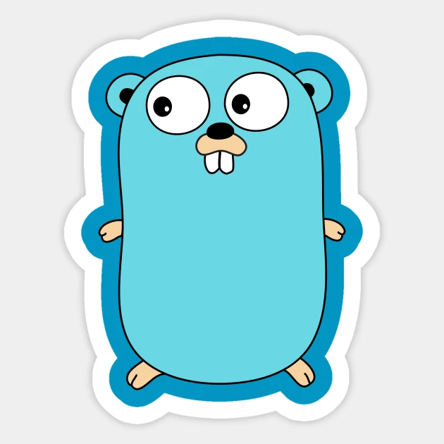
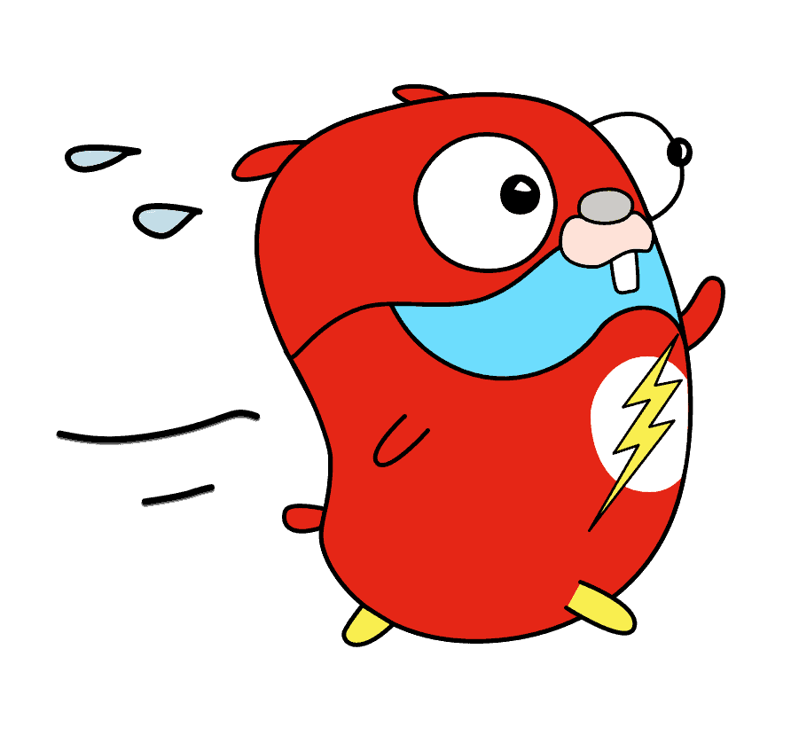

# Go语言简介

## 1.Go语言的诞生背景

Go语言是2007年由Google推出的一种开源编程语言，旨在提高开发人员的效率和编译速度，以及优化现代计算机的多核处理能力。Go语言的设计者包括Robert Griesemer、Rob Pike和Ken Thompson，他们都是曾经参与过Unix、Plan 9和Inferno等操作系统的开发。

Go语言的诞生背景可以追溯到Google内部的一个项目，该项目旨在构建一个能够支持快速开发和大规模分布式系统的编程语言。这个项目最初被称为“20%项目”，因为Google允许员工将“20%的工作时间”用于自己的项目和研究，其中 Google Gmail、Google News、Google Map、Adsense都是“20%项目”的产物。

在经过多次迭代和优化之后，Go语言于2009年正式发布。Go语言的设计灵感来源于C语言、Pascal语言、Algol语言和其他一些语言，但Go语言的语法和结构更加简洁，易于学习和使用。同时，Go语言还具有强大的并发编程能力和垃圾回收机制，可以大大提高开发人员的编程效率。

自发布以来，Go语言已经成为了一种广泛使用的编程语言，被用于开发各种类型的应用程序，包括网络应用、分布式系统、云计算、操作系统和网络安全等领域。

---

## 2.Go语言的特性

Go语言具备以下特性：
- 简洁易学：Go语言采用简单的语法和结构，易于学习和使用，可以大大提高开发人员的编程效率。
- 高效编译：Go语言的编译速度非常快，可以快速生成可执行文件或库文件，提高开发和部署的效率。
- 并发编程：Go语言内置了轻量级线程（Goroutine）和通道（Channel）机制，可以方便地实现高效的并发编程，提高程序的性能和可靠性。
- 内存安全：Go语言具有自动垃圾回收机制，可以有效地防止内存泄漏和野指针等常见的内存安全问题。
- 静态类型：Go语言是一种静态类型语言，可以在编译时检查类型错误，提高程序的健壮性和可维护性。
- 开源社区：Go语言是一种开源的编程语言，拥有一个活跃的社区，提供了丰富的开发工具和库，方便开发人员快速构建应用程序。

---

## 3.Go语言的官网和仓库地址

<html>
    
</html>

Go语言官网地址：[http://go.dev](http://go.dev)

Go语言GitHub仓库地址：[https://github.com/golang](https://github.com/golang)

---

## 4.Go语言的创始人

Go的三个作者分别是：Rob Pike【罗伯.派克】、Ken Thompson【肯.汤普森】、Robert Griesemer【罗伯特.格利茨默】
- Rob Pike：曾是贝尔实验室（Bell Labs）的Unix团队，和Plan 9操作系统计划的成员。他与Thompson共事多年，并共创出广泛使用的UTF-8 字元编码
- Ken Thompson：主要是B语言、C语言的作者、Unix之父。1983年图灵奖（Turing Award）和1998年美国国家技术奖（National Medal of Technology）得主。他与Dennis Ritchie是Unix的原创者。Thompson也发明了后来衍生出C语言的B程序语言。
- Robert Griesemer：在开发Go之前是Google V8、Chubby和HotSpot JVM的主要贡献者。

以下是三位作者的网络图片

<html>
    
</html>

---

## 5.Go语言能做什么？

Go 语言从发布 1.0 版本以来备受众多开发者关注并得到广泛使用，Go 语言的简单、高效、并发特性吸引了众多传统语言开发者的加入，而且人数越来越多。

鉴于Go语言的特点和设计的初衷，Go语言作为服务器编程语言，很适合处理日志、数据打包、虚拟机处理、文件系统、分布式系统、数据库代理等；网络编程方面，Go语言广泛应用于Web 应用、API应用、下载应用等；除此之外，Go语言还适用于内存数据库和云平台领域，目前国外很多云平台都是采用Go开发。
- 服务器编程，以前你如果使用C或者C++做的那些事情，用Go来做很合适，例如处理日志、数据打包、虚拟机处理、文件系统等。
- 分布式系统、数据库代理器、中间件等，例如Etcd。
- 网络编程，这一块目前应用最广，包括Web应用、API应用、下载应用，而且Go内置的net/http包基本上把我们平常用到的网络功能都实现了。
- 数据库操作
- 开发云平台，目前国外很多云平台在采用Go开发。

---

## 6.有哪些公司在使用Go语言

### 6.1 PingCAP

代表项目有：[tidb](https://github.com/pingcap/tidb)

### 6.2 字节跳动

代表项目：[kitex](https://github.com/cloudwego/kitex)、[hertz](https://github.com/cloudwego/hertz)、[netpoll](https://github.com/cloudwego/netpoll)

### 6.3 哔哩哔哩

代表项目：[kratos](https://github.com/go-kratos/kratos)、[gateway](https://github.com/go-kratos/gateway)

### 6.4 优秀的开源项目

代表项目：[docker](https://github.com/moby/moby)、[kubernetes](https://github.com/kubernetes/kubernetes)、[grafana](https://github.com/grafana/grafana)、[etcd](https://github.com/etcd-io/etcd)、[traefik](https://github.com/traefik/traefik)、[gogs](https://github.com/gogs/gogs)、[minio](https://github.com/minio/minio)、[docker-compose](https://github.com/docker/compose)、[fiber](https://github.com/gofiber/fiber)、[minikube](https://github.com/kubernetes/minikube)、[influxdb](https://github.com/influxdata/influxdb)、[go-zero](https://github.com/zeromicro/go-zero)等等...

---

## 7.Go语言的吉祥物和logo

### 7.1 Go语言的logo

下图就是Go语言的logo，就只有GO两个字母。

<html>
    
</html>

### 7.2 Go语言吉祥物

Go语言的吉祥物名为：Gopher

以下就是Gopher的形象。

<html>
    
    
    
</html>

---

## 8.Go语言的安装

### 8.1 MacOS系统

```shell
# 这里使用的是brew安装和更新go
brew install go

# 更新go
brew upgrade go
```

配置用户的环境变量配置文件`.bash_profile`文件，加入Go的环境变量。

```shell
# go
export GOROOT=go语言安装的目录 # go安装的目录，使用brew安装通常都会在/opt/homebrew/Cellar目录下。
export GOPATH=自定义go源码文件存放目录
export GOBIN=$GOPATH/bin
export PATH=$PATH:$GOPATH/bin

# 配置go module 和 go proxy
export GO111MODULE=on
export GOPROXY=https://goproxy.cn
```

### 8.2 Windows系统

略。。。

### 8.3 Linux发行版

略。。。
